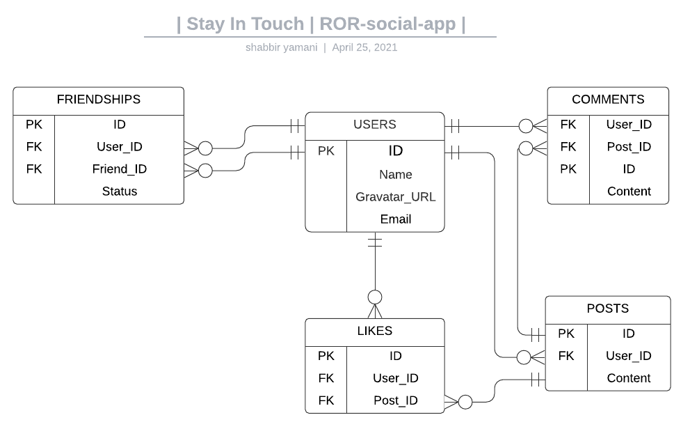

# Project : STAY IN TOUCH
> The project builds 
## Scaffold for social media app with Ruby on Rails
> This repo includes intial code for social media app with basic styling. Its purpose is to be a starting point for Microverse students. 
#### Highlight: Users->List, Users->Invites Friends, Users->Gets Invited By Friends, 



### Built With

- Ruby, Ruby on Rails, VS Code Editor
- Active Records
- Devise Gem
- Forms & Helpers
- Rspec, Capybara, Selenium
- Browser: Chrome {change/override in this File, Last Line: ``` spec\rails_helper.rb ```}
### Getting Started
#### Model generated:
- User Authentication
  - Signup
  - Signin
- All Users
  - View Users Profile & Posts
    - Add Friend From Individual User Profile
    - Accept/Reject Invitation
  - Add Friend From All Users List
  - View Invite Pending Status
- Timeline
  - Posts ordered Recent First
  - Posts from Friends only
### Setup
* To clone this repository, open your Terminal and execute the following command:
``` git clone https://github.com/smy5152/Private-events.git ```
### Run
* Change into the folder
``` cd private-only ```
* Install js dependencies
``` yarn install ```
* Install gems
``` bundle install ```
* Run Database migrations
``` rails db:create ```
``` rails db:migrate ```
* Rails Local Server
``` rails server ``` 
* Launch Local App
- Open your browser and type http://localhost:3000
### How to run the test suite
#### Run tests
``` rpsec --format documentation  ```
### How To:
* Run Rails console
``` rails console ```
## Authors
🧑‍💻 **Shabbir**
- GitHub: [@smy5152](https://github.com/smy5152)
- Twitter: [@smy5152](https://twitter.com/smy5152)
- LinkedIn: [Shabbir Yamani](https://www.linkedin.com/in/shabbirmyamani/)
## 🤝 Contributing
Contributions, issues, and feature requests are welcome!
## Show your support
Give a ⭐️ if you like this project!
## Acknowledgments
- [Micoverse team](https://www.microverse.org/)
## 📝 License
This project is [MIT](LICENSE) licensed.
